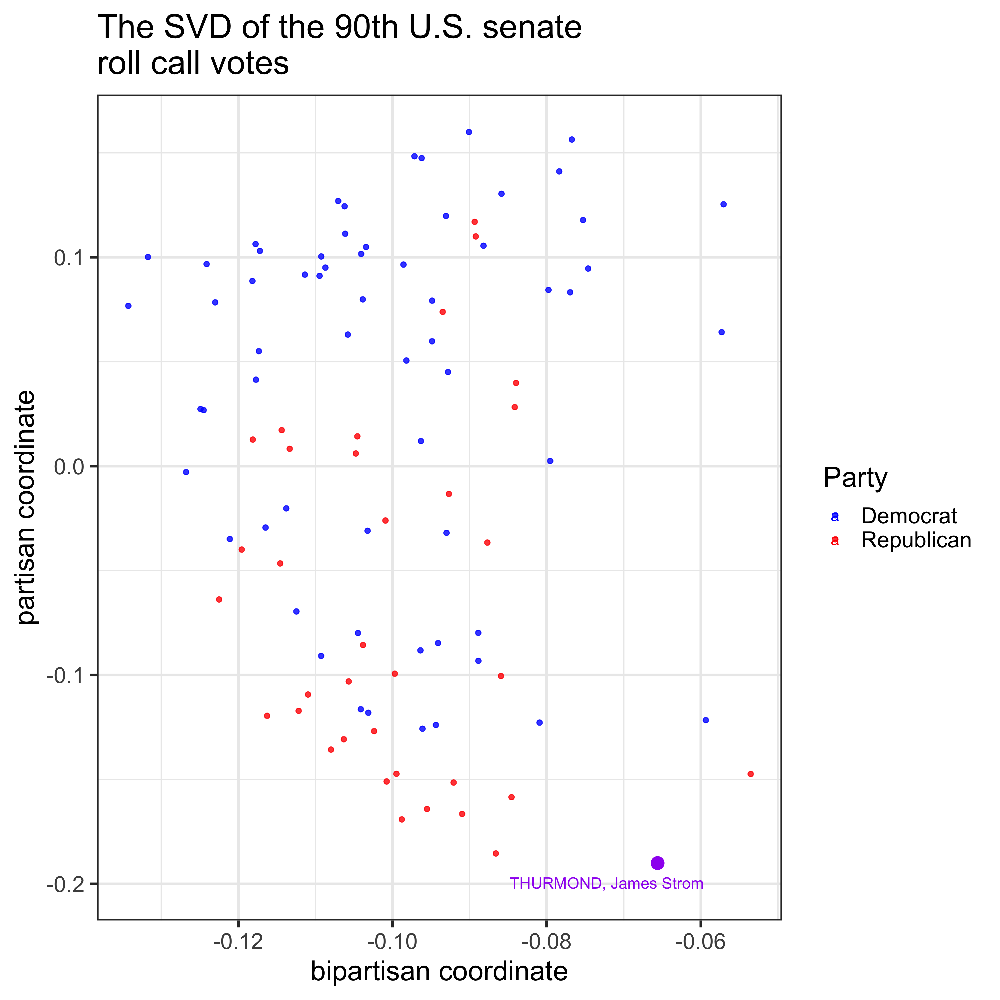
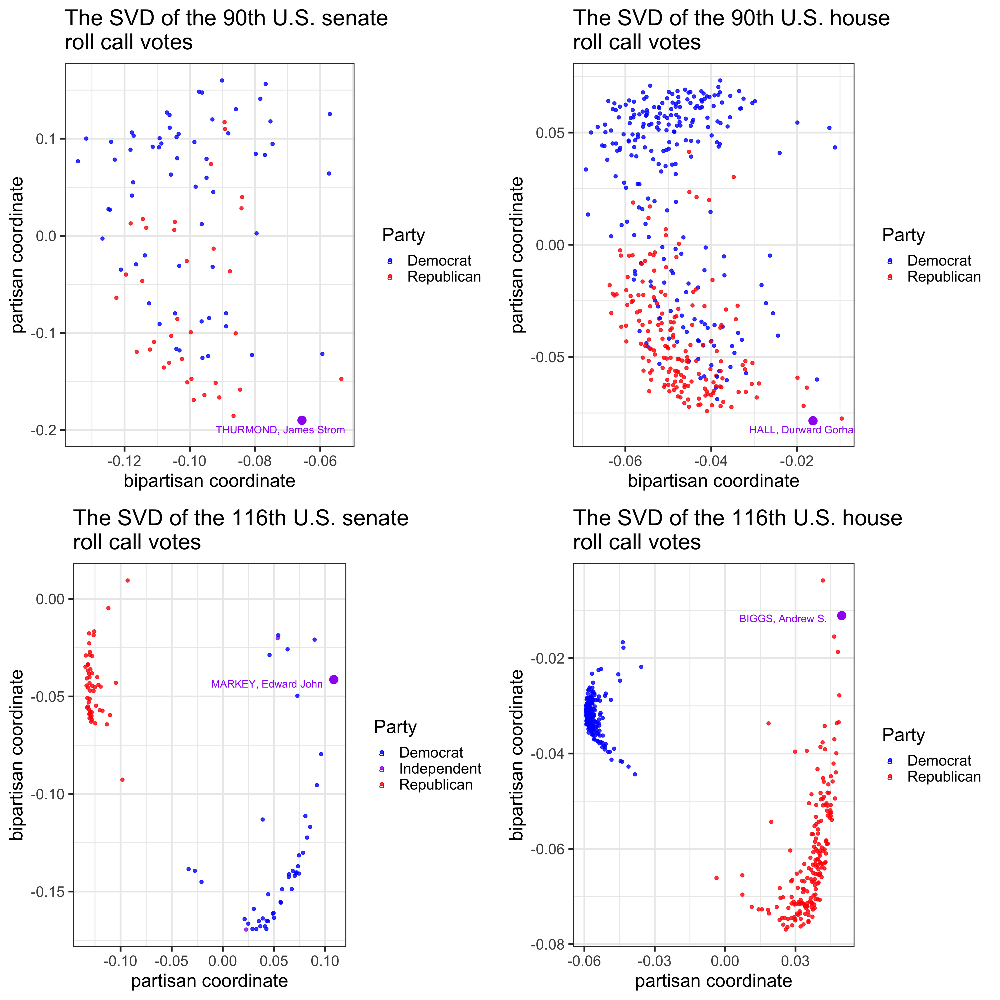
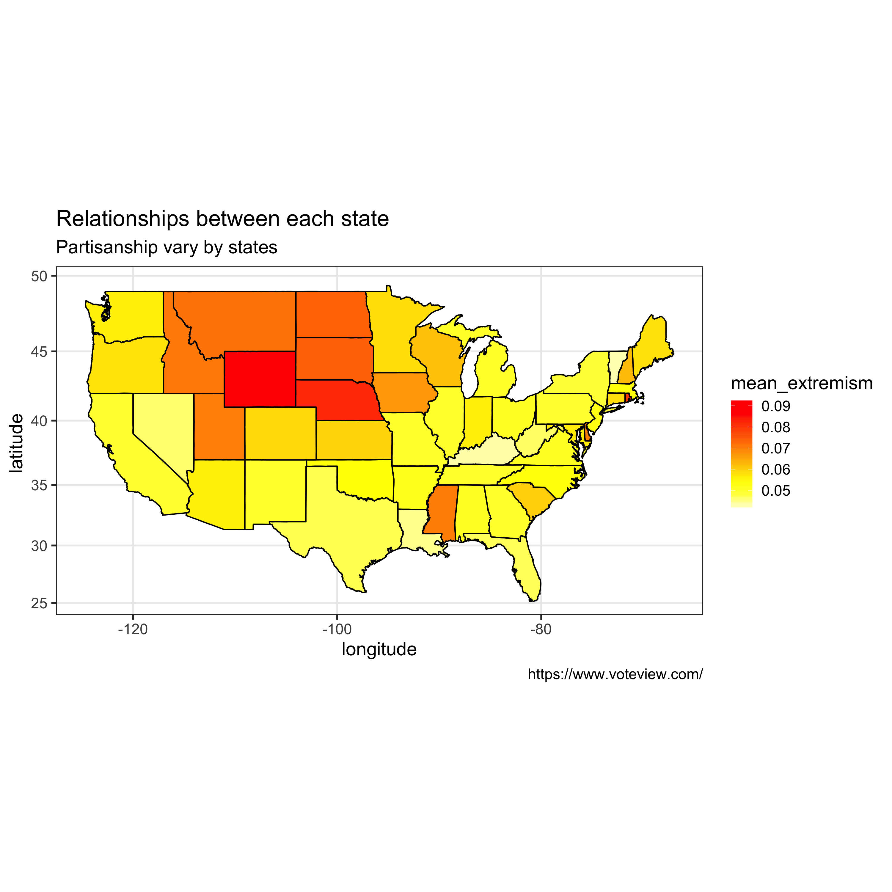

<!--- Begin styling code. --->
<style type="text/css">
/* Whole document: */
body{
  font-family: "Palatino Linotype", "Book Antiqua", Palatino, serif;
  font-size: 12pt;
}
h1.title {
  font-size: 38px;
  text-align: center;
}
h4.author {
  font-size: 18px;
  text-align: center;
}
h4.date {
  font-size: 18px;
  text-align: center;
}
</style>
<!--- End styling code. --->

## Background
Congress serves as the most important legislative branch of the national government.Members of Congress employ Roll-call vote to vote for or against one motion towards the passing of legislation. Thus, the roll call voting records, which records legislators' vote on each bill, show not only ideology but also party affiliation of senators and congressmen. 

Here we apply singular value decomposition (aka SVD) to examine political positions of members of Congress so that partisanship of U.S. Congress, if there is any, can be revealed.

## Data description
To explore the partisanship, we used the 90th and the 116th roll call voting records from both the Senate and the House of Representatives. It was downloaded from [this website](https://bryandmartin.github.io/STAT302/docs/Projects/project2/project2.html).<br/><br/>Each row represents related information and roll call votes of each legislator. The related information is about their bioname, state, party and the year when they were born. The elements in "rc" columns is their voting results. Each senator or congressman's "Yea", "Nay" vote or "Not present or not a member of chamber during roll call" was represented by 1, -1 or 0 respectively. Because roll call voting result of NAs indicates mssing data for unknown reason (due to campaign-related absenteeism, etc.) and we want the data for analysis to be as accurate as possible, we remove rows with NAs in the data preprocessing.<br/><br/>According to the data, during the 90th Congress the Senate conducted 596 roll call votes and the House conducted 478. For the 116th Congress, the Senate conducted 460 roll call votes and that number was 733 for the House.  

## Questions to be explored in this report
The 90th U.S. Congress was from the year 1967 to 1969, whereas the 116th Congress convened in 2019 and it will end in 2021. We wonder how the partisanship of Congress has changed these days compared to that of Congress around 50 years ago.<br/><br/>We also expected difference between partisanship in the Senate and the House since members from the two different bodies are from different social status backgroud. They share no common age, citizenship requirements and term of office.<br/><br/>Moreover, we would like to know if partisanship vary by state and Who are the most “extreme” partisans in Congress. With these questions below in mind let's begin analyzing roll call voting records with SVD.

1. How does partisanship compare in the House of Representatives vs. the Senate?
2. How does partisanship compare in the 90th Congress vs. the 116th Congress?
3. Does partisanship vary by state?
4. Who are the most “extreme” partisans in Congress?

## Data Analysis

First let's construct a matrix with its rows representing legislators and its columns representing roll call votes.

In the case of the Sanate voting records of the 90th Congress, we get **98 X 596** matrix, denoted **A**. Each roll call vote is represented by a 98-entry vector. The matrix A is at most a 98-dimensional subspace of a 596-dimensional space. And it can be decomposed to multiplication of three matrices: **U** and **V** are orthogonal matrices; **D** is a diagonal matrix.See equation below.
$$\mathbf{A} = \mathbf{U} \mathbf{D} \mathbf{V}^T$$
The element of the matrix is donoted ${\mathbf{A}}_{ij}$, and we can calculate the *optimal* rank $k$ approximation the matrix $\mathbf{A}$. And it can be obtained by summing up the product first k singular values and singular vectors. See equation below.


$$\tilde{\mathbf{A}}_k = \sum_{i=1}^{k} \sigma_i \mathbf{u}_i\mathbf{v}_i^T $$
Thus, in this case, by applying singular vector decomplostion to matrix **A**, we can obtain an optimal **k** coordinate system to represent each legislative.

How many singular values should be retained?

[This research article (Porter et al., 2005)](https://bryandmartin.github.io/STAT302/docs/Projects/project2/HouseOfRepresentatives.pdf) has found that two leading singular vectors are enough to encapsulate the most party affiliation and ideology for legislators. 

That is, the **k** here is 2. And a good approximation to the roll call voting matrix **A** can be projected into two dimensions by their two largest SVD coordinates：the first left leading singular vector and the second left leading singular vector. 
See the equation below. 
$$\mathbf{A}_{ij}^{(2)} = \sigma_1 \mathbf{u}_i^{(1)}\mathbf{v}_j^{T(1)} + \sigma_2 \mathbf{u}_i^{(2)}\mathbf{v}_j^{T(2)} $$
In the spirit of this research, we retained two singular values and create a 2-dimensional political position map of the senate in 90th Congress. The energy maintained is **49.4%**.

See **Fig 1**. Interestingly, we can see that despite a diverse spectrum this figure clusters senators by their party. However, the figure is generated using only their voting data. That being said, there exists partisanship among the 90th Senate.

Another thing needs to be noticed. That is the purple point in the figure. It represents the most extremism on political position. The way we quantify this "extremism" is by computing a measure of ‘‘extremism’’for each legislator as the absolute value of their partisan coordinate relative to the mean partisan score of the full Senate. (reference: [Porter et al., 2005)](https://bryandmartin.github.io/STAT302/docs/Projects/project2/HouseOfRepresentatives.pdf) )

<image>

<figcaption>Fig.1 - The SVD of the 90th U.S. Senate roll call votes. The x axis and y axis represents the two most significant singular vector. The vector on x axis (the “bipartisan” coordinate) represents how legislatives vote with the majority. And the other vector on y axis (the “partisan” coordinate) show party affiliation for them. Each point represents each senator's political position. Democratic and Republican senators have been colored blue and red, respectively. The point highlighted in purple color is the most "extrem" one who has the highest extremism score. And his bioname is annotated near the point. </figcaption>
<image>


###### *plot of fig.1 from the session of partisanship of the 90th Senate*


**Now let's compare partisanship in the House of Representatives vs. the Senate. **See **Fig 2**. 

The top-left plot(The two dimensions maintained **49.4%**) and top-right plot (**56.5%** energy is maintained) show partisanship among the Senate and the House in the 90th Congres repectively. 

By comparing the two of them, there is a dense cluster and much more diverse spectrum in the House. Similarly, the House(bottom-right plot; **80.5%** energy maintained) looks more divided than the Senate(bottom-left plot; **84.2%** energy maintained) in the 116th Congress. 

**Now that we know that partisanship vary between the Senate and the House. How about partisanship'change after 50 years go by?** Also see **Fig 2**. 

By comparing plots in **Fig 2** vertically, we know that regardless of the houses there is clearly much more partisanship in U.S. Congress these days than that in the year 1967 to 1969.

Because SVD groups the legislators into far denser clusterings in the 116th Congress and there is a clearer divide between these two party members.Whereas there is a much broader spectrum of voting records for the 90th Congress, which indicates more similar vote partterns.

<image>

<figcaption>Fig.2 - The SVD of the 90th and the 116th U.S. Senate along with the 90th and the 116th U.S House roll call votes. The x axis and y axis represents the two most significant singular vector. The “bipartisan” coordinate represents how legislatives vote with the majority. And the other coordinate (the “partisan” coordinate) show party affiliation for them. Each point represents each legislator's political position. Democratic, Republican and Independent have been colored blue, red and purple, respectively.The point highlighted in purple color is the most "extrem" one who has the highest extremism score. And his bioname is annotated near the point. </figcaption>
<image>

###### *top-left plot of fig.2 from the session of partisanship of the 90th Senate*
###### *top-right plot of fig.2 from the session of partisanship of the 90th House*
###### *bottom-left plot of fig.2 from the session of partisanship of the 116th Senate*
###### *bottom-right plot of fig.2 from the session of partisanship of the 116th House*

**So far we have known partisanship does exist among the U.S. Congress. Here comes the question. Who are the most “extreme” partisans in Congress?  **See **Fig 2**. 

Due to highest "extremism" meausure score, all the four highlighted purple points are what we are looking for. They are **THURMOND, James Strom** (Democrat; the 90th Senate), **MARKEY, Edward John** (Democrat; the 116th Senate), **HALL, Durward Gorham** (Republican; the 90th Senate), **BIGGS, Andrew S.**(Republican; the 116th House)

**Another aspect we are curious about the data is if partisanship vary among states. **

To approach this issue, We combined all the four data and employ the mean "extremism" score of a state to represent partisanship. Then we visualized it with the heat map. See **Fig 3**. 

This figure features the mean extremism score, grouped by U.S. states. In general, partisanship varys by states with different cell color across the States. We can also see that states of Wyoming and Nebraska have the most partisanship. States of Nevada and Kentucky, however, features low mean extremism score, which means partisanship in these states are not much.

<image>

<figcaption>Fig.3 - This figure depicts partisanship by states. X axis represents longitude and y axis represents latitude. The color of the cell shows the mean extremism score of a state. The cell colors have a hierarchy of shades from the darkest (red as highest values) to the light shades (light yellow as the lowest value). 
</figcaption>
<image>

###### *plot of fig.3 from the session of partisanship of different states*


## Summary
In a nutshell, in this report we **conducted singular vector decomposition to roll call voting records of the Congress** so as to explore the partisanship of the U.S Congress. 

To recap what we have found, (1) The House has more partisanship than the Senate; (2) Partisanship in the 116th Congress has increased compared against the 90th Congress; (3) Partisanship varies by state. (4) Four legislators are found to be the most extrem: They are **THURMOND, James Strom** (Democrat; the 90th Senate), **MARKEY, Edward John** (Democrat; the 116th Senate), **HALL, Durward Gorham** (Republican; the 90th Senate), **BIGGS, Andrew S.**(Republican; the 116th House) 


### **Code Appendix**
```{r,eval = FALSE}

# load libraries
library("tidyverse")
library("foreign")
library("ggrepel")
library("maps")
library("mapproj")
library("openintro")


# import data
house_90_raw  <- read.csv("https://raw.githubusercontent.com/bryandmartin/STAT302/master/docs/Projects/project2/house_90_raw.csv")
house_116_raw  <- read.csv("https://raw.githubusercontent.com/bryandmartin/STAT302/master/docs/Projects/project2/house_116_raw.csv")
senate_90_raw  <- read.csv("https://raw.githubusercontent.com/bryandmartin/STAT302/master/docs/Projects/project2/senate_90_raw.csv")
senate_116_raw <- read.csv("https://raw.githubusercontent.com/bryandmartin/STAT302/master/docs/Projects/project2/senate_116_raw.csv")

### Take for example senate voting records in the 90th Congres ###
# dimensions of the matrix after NAs are removed
#senate_90_NA_removed <- data_raw[complete.cases(senate_90_raw), ]
#senate_90_rc <- senate_90_NA_removed %>%
#  select(-c(1, 2, 3, 4))
#row_no <- dim(senate_90_rc)[1]
#col_no <- dim(senate_90_rc)[2]
### Create a function
## input
## output
## us


############## partisanship of the 90th Senate #############

# set the values to variables: house_type, th_NO and data_raw. The variable
# house_type is the House of Representatives or the Senate. The variable th_No 
# here is 90th or 116th. 

house_type = "senate"; th_NO = "90"; data_raw = senate_90_raw

# check for NAs
data_raw %>%
  
  # check for NAs of each column
  map_df(~ sum(is.na(.))) %>%
  
  # gather the NA counts and show it as a tibble
  gather(key = "rc", value = "missing_count") %>%
  
  # sort the tibble by NA counts in a descending order
  arrange(desc(missing_count))


# remove NAs
data_NA_removed <- data_raw[complete.cases(data_raw), ]

# extract bioname and rc columns, and generate SVD
data_name_rc_svd <- data_NA_removed %>%
  select(-c(1, 2, 3, 4)) %>%
  svd()

# plot the clustering result
data_name_rc_df <- data.frame("x" = data_name_rc_svd$u[, 1],
  "y" = data_name_rc_svd$u[, 2],
  "label" = data_NA_removed$bioname,
  "party_code" = data_NA_removed$party_code )

# get the retained energy
sing_vals2 <- data_name_rc_svd$d^2
energy_maintained_1 = sum(sing_vals2[1] + sing_vals2[2]) / sum(sing_vals2)


## calculate the measure "extremism"
data_extremism_df_1 <- data.frame("name" = data_NA_removed$bioname, 
                                  "state" = data_NA_removed$state_abbrev, 
                                  "score" = data_name_rc_svd$u[, 2]) %>%
  mutate(extremism = abs(score - mean(score))) %>%
  arrange(desc(extremism))

# extract the row with most extremism as highlighted data
data_highlight <- data_name_rc_df %>% 
  filter(label == as.character(data_extremism_df_1[1, 1]))


  senate_90_plot <- ggplot(data_name_rc_df, 
                           aes(x = x, 
                               y = y, 
                               label = "", 
                               color = party_code)) +
  xlab("bipartisan coordinate") +
  ylab("partisan coordinate") +
  labs(title = paste("The SVD of the ",
                     th_NO, 
                     "th U.S. ",
                     house_type, 
                     "\nroll call votes", sep = "")) +
  geom_point(alpha = 0.8) +
  geom_point(data = data_highlight , 
             color = 'purple', 
             size = 4) +
  annotate(
    geom = "text",
    x = data_highlight[1, 1] * 1.1,
    y = data_highlight[1, 2] * 1.05,
    size = 4, 
    colour = "purple",
    label = as.character(data_extremism_df_1[1, 1])) +
  theme_bw(base_size = 20) +
  geom_text_repel(size = 4) +
  scale_color_manual(name = "Party",
                     labels = c("Democrat", "Republican"),
                     values=c("blue", "red"))
  
############## partisanship of the 90th House #############

# set the values to variables: house_type, th_NO and data_raw. The variable
# house_type is the House of Representatives or the Senate. The variable th_No 
# here is 90th or 116th. 

house_type = "house"; th_NO = "90"; data_raw = house_90_raw

# check for NAs
data_raw %>%
  
  # check for NAs of each column
  map_df(~ sum(is.na(.))) %>%
  
  # gather the NA counts and show it as a tibble
  gather(key = "rc", value = "missing_count") %>%
  
  # sort the tibble by NA counts in a descending order
  arrange(desc(missing_count))


# remove NAs
data_NA_removed <- data_raw[complete.cases(data_raw), ]

# extract bioname and rc columns, and generate SVD
data_name_rc_svd <- data_NA_removed %>%
  select(-c(1, 2, 3, 4)) %>%
  svd()

# get the retained energy
sing_vals2 <- data_name_rc_svd$d^2
energy_maintained_2 = sum(sing_vals2[1] + sing_vals2[2]) / sum(sing_vals2)


# plot the clustering result
data_name_rc_df <- data.frame("x" = data_name_rc_svd$u[, 1],
  "y" = data_name_rc_svd$u[, 2],
  "label" = data_NA_removed$bioname,
  "party_code" = data_NA_removed$party_code )

## calculate the measure "extremism"
data_extremism_df_2 <- data.frame("name" = data_NA_removed$bioname, 
                                  "state" = data_NA_removed$state_abbrev, 
                                  "score" = data_name_rc_svd$u[, 2]) %>%
  
  mutate(extremism = abs(score - mean(score))) %>%
  arrange(desc(extremism))

# extract the row with most extremism as highlighted data
data_highlight <- data_name_rc_df %>% 
  filter(label == as.character(data_extremism_df_2[1, 1]))


house_90_plot <- ggplot(data_name_rc_df, aes(x = x, 
                                             y = y, label = "", 
                                             color = party_code)) +
  xlab("bipartisan coordinate") +
  ylab("partisan coordinate") +
  labs(title = paste("The SVD of the ", 
                     th_NO, "th U.S. ", 
                     house_type, 
                     "\nroll call votes", 
                     sep = "")) +
  geom_point(alpha = 0.8) +
  geom_point(data = data_highlight , color='purple', size=4) +
  annotate(
    geom = "text",
    x = data_highlight[1,1] * 1.1,
    y = data_highlight[1,2] * 1.05,
    size = 4,
    colour = "purple",
    label = as.character(data_extremism_df_2[1,1])) +
  theme_bw(base_size = 20) +
  geom_text_repel(size = 4) +
  scale_color_manual(name = "Party", 
                     labels = c("Democrat", "Republican"), 
                     values = c("blue", "red"))

############## partisanship of the 116th Senate #############

# set the values to variables: house_type, th_NO and data_raw. The variable
# house_type is the House of Representatives or the Senate. The variable th_No 
# here is 90th or 116th. 

house_type = "senate"; th_NO = "116"; data_raw = senate_116_raw

# check for NAs
data_raw %>%
  
  # check for NAs of each column
  map_df(~ sum(is.na(.))) %>%
  
  # gather the NA counts and show it as a tibble
  gather(key = "rc", value = "missing_count") %>%
  
  # sort the tibble by NA counts in a descending order
  arrange(desc(missing_count))


# remove NAs
data_NA_removed <- data_raw[complete.cases(data_raw), ]

# extract bioname and rc columns, and generate SVD
data_name_rc_svd <- data_NA_removed %>%
  select(-c(1, 2, 3, 4)) %>%
  svd()

# get the retained energy
sing_vals2 <- data_name_rc_svd$d^2
energy_maintained_3 = sum(sing_vals2[1] + sing_vals2[2]) / sum(sing_vals2)


# plot the clustering result
data_name_rc_df <- data.frame("x" = data_name_rc_svd$u[, 1],
  "y" = data_name_rc_svd$u[, 2],
  "label" = data_NA_removed$bioname,
  "party_code" = data_NA_removed$party_code)

## calculate the measure "extremism"
data_extremism_df_3 <- data.frame("name" = data_NA_removed$bioname, 
                                  "state" = data_NA_removed$state_abbrev, 
                                  "score" = data_name_rc_svd$u[, 1]) %>%
  mutate(extremism = abs(score - mean(score))) %>%
  arrange(desc(extremism))

# extract the row with most extremism as highlighted data
data_highlight <- data_name_rc_df %>% 
  filter(label == as.character(data_extremism_df_3[1, 1]))


senate_116_plot <- ggplot(data_name_rc_df, 
                          aes(x = x, 
                              y = y, 
                              label = "", 
                              color = party_code)) +
  xlab("partisan coordinate") +
  ylab("bipartisan coordinate") +
  labs(title = paste("The SVD of the ", 
                     th_NO, "th U.S. ",
                     house_type,
                     "\nroll call votes",
                     sep = "")) +
  geom_point(alpha = 0.8) +
  geom_point(data = data_highlight , color='purple', size=4)  +
  annotate(
    geom = "text",
    x = data_highlight[1,1] * 0.4,
    y = data_highlight[1,2] * 1.05,
    size = 4,
    colour = "purple",
    label = as.character(data_extremism_df_3[1,1])) +
  theme_bw(base_size = 20) +
  geom_text_repel(size = 4)  +
  scale_color_manual(name = "Party", 
                     labels = c("Democrat", "Independent", "Republican"),
                     values=c("blue", "purple", "red"))

############## partisanship of the 116th House #############

# set the values to variables: house_type, th_NO and data_raw. The variable
# house_type is the House of Representatives or the Senate. The variable th_No 
# here is 90th or 116th. 

house_type = "house"; th_NO = "116"; data_raw = house_116_raw

# check for NAs
data_raw %>%
  
  # check for NAs of each column
  map_df(~ sum(is.na(.))) %>%
  
  # gather the NA counts and show it as a tibble
  gather(key = "rc", value = "missing_count") %>%
  
  # sort the tibble by NA counts in a descending order
  arrange(desc(missing_count))


# remove NAs
data_NA_removed <- data_raw[complete.cases(data_raw), ]

# extract bioname and rc columns, and generate SVD
data_name_rc_svd <- data_NA_removed %>%
  select(-c(1, 2, 3, 4)) %>%
  svd()

# get the retained energy
sing_vals2 <- data_name_rc_svd$d^2
energy_maintained_4 = sum(sing_vals2[1] + sing_vals2[2])/sum(sing_vals2)


# plot the clustering result
data_name_rc_df <- data.frame("x" = data_name_rc_svd$u[, 1],
  "y" = data_name_rc_svd$u[, 2],
  "label" = data_NA_removed$bioname,
  "party_code" = data_NA_removed$party_code )

## calculate the measure "extremism"
data_extremism_df_4 <- data.frame("name" = data_NA_removed$bioname, 
                                  "state" = data_NA_removed$state_abbrev, 
                                  "score" = data_name_rc_svd$u[, 1]) %>%
  mutate(extremism = abs(score - mean(score))) %>%
  arrange(desc(extremism))

# extract the row with most extremism as highlighted data
data_highlight <- data_name_rc_df %>% 
  filter(label == as.character(data_extremism_df_4[1,1]))


house_116_plot <- ggplot(data_name_rc_df, 
                         aes(x = x, y = y, 
                             label = "", 
                             color = party_code)) +
  xlab("partisan coordinate") +
  ylab("bipartisan coordinate") +
  labs(title = paste("The SVD of the ", 
                     th_NO, "th U.S. ",house_type, 
                     "\nroll call votes", sep = "")) +
  geom_point(alpha = 0.8) +
  geom_point(data = data_highlight , color='purple', size=4) +
  annotate(
    geom = "text",
    x = data_highlight[1,1] * 0.5,
    y = data_highlight[1,2] * 1.05,
    size = 4,
    colour = "purple",
    label = as.character(data_extremism_df_4[1,1])) +
  theme_bw(base_size = 20) +
  geom_text_repel(size = 4) +
  scale_color_manual(name = "Party", labels = c("Democrat", "Republican"), values=c("blue", "red"))

############################ save plots to files #################################

require(gridExtra)
compare_senate_house <- grid.arrange(senate_90_plot,
                                     house_90_plot,
                                     senate_116_plot,
                                     house_116_plot,
                                     ncol=2, nrow = 2)

ggsave(filename = "senate_90.png", senate_90_plot,
  width = 10, height = 10)

ggsave(filename = "house_90.png", house_90_plot,
  width = 10, height = 10)

ggsave(filename = "senate_116.png", senate_116_plot,
  width = 10, height = 10)

ggsave(filename = "house_116.png", house_116_plot,
  width = 10, height = 10)


ggsave(filename = "compare_senate_house.png", compare_senate_house,
  width = 15, height = 15)

########################### partisanship of different states #####################

# bind the four extremism dataframe into a big one
total_extremism_df <- rbind(data_extremism_df_1, 
                            data_extremism_df_2, 
                            data_extremism_df_3, 
                            data_extremism_df_4)

# calculate each state's mean extremism
extremism_by_state <- total_extremism_df %>% 
  group_by(state) %>%
  summarise(mean(extremism)) %>%
  rename( mean_extremism = `mean(extremism)`)

# add a column of full names of states
extremism_by_state$region <- tolower(abbr2state(extremism_by_state$state))

states <- map_data("state")

# merge the map data and extremism_by_state data
map.df <- merge(states,
                extremism_by_state, by = "region", all.x = T)
map.df <- map.df[order(map.df$order), ]

# plot the heat map 
extremism_state_plot <- ggplot(map.df, 
                               aes(x = long,
                                   y = lat,
                                   group = group)) +
  geom_polygon(aes(fill = mean_extremism )) +
  geom_path() + 
  scale_fill_gradientn(colours = rev(heat.colors(10)), na.value = "grey90") +
  coord_map() +
  xlab("longitude") +
  ylab("latitude ") +
  labs(title = "Relationships between each state",
       subtitle = "Partisanship vary by states",
       caption = "https://www.voteview.com/") +
  
 theme(plot.title = element_text(face = "bold",
                                  size = 16),
        axis.title.x = element_text(size = 14),
        axis.title.y = element_text(size = 14),
        axis.text.x = element_text(face = "bold"),
        axis.text.y = element_text(face = "bold")) +
  theme_bw(base_size = 15)


ggsave(filename = "extremism_state.png", extremism_state_plot,
  width = 10, height = 10)


```

